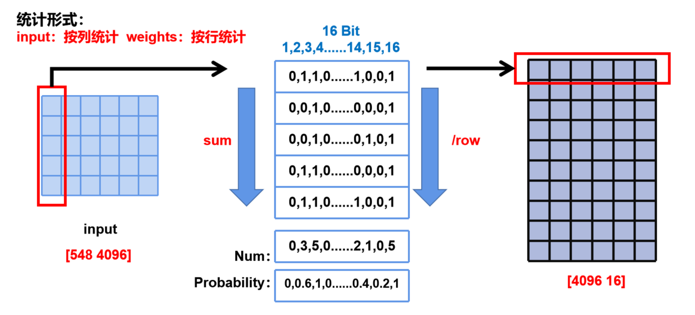
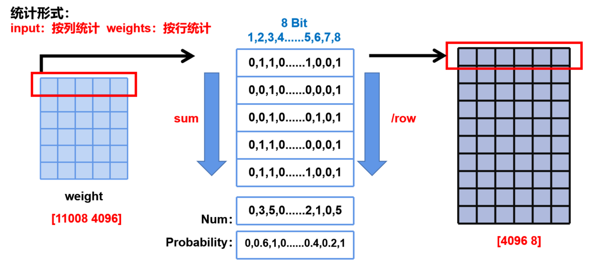

### README.md

```markdown
# bitsparsity

## 项目简介

bitsparsity 是一个用于修改和优化机器学习模型的工具，专注于位级别的稀疏性。通过调整模型的位概率，本项目旨在提高模型的效率和性能，同时减少资源消耗。


## 目录结构

```
bitsparsity/
├── setup.py
├── bitmodify.ipynb
├── print_orgin.py
├── bitmod.cpp
├── README.md
└── requirements.txt
```

## 文件说明

- **setup.py**
  
  用于安装扩展模块 `bitmod`。该文件配置了 C++ 扩展的编译参数，包括依赖的头文件目录和编译选项。

- **bitmodify.ipynb**
  
  Jupyter Notebook，包含了模型加载、位概率修改、保存模型及概率的完整流程。

- **print_orgin.py**
  
  主要用于统计原始大模型的weight权重的01分布情况，目前我统计的是概率分布，两位可以修改成整个矩阵的01统计。但是这个写的比较早，里面的二进制转换等处理函数是用python实现的，非常慢，可以修改成用包含c++工具函数的bitmod.cpp里的功能实现，会快很多。

- **bitmod.cpp**
  
  用于加速二进制转换或者01概率修改处理的 C++ 工具函数。

- **requirements.txt**
  
  列出了项目所需的 Python 依赖库，使用 `pip install -r requirements.txt` 可一键安装。

## 安装

1. **克隆仓库**

   ```bash
   git clone
   cd bitsparsity
   ```

2. **创建并激活 Conda 虚拟环境**

   ```bash
   conda create -n bitsparsity-env python=3.8
   conda activate bitsparsity-env
   ```

3. **安装依赖**

   ```bash
   pip install -r requirements.txt
   ```

4. **安装扩展模块**

   ```bash
   python setup.py install
   ```


## 用法

### 前面提到到“概率”到底是啥，如何统计的bit概率，虽然肯定要修改这部分以适合二位的需求，但是这里介绍清楚避免看代码产生困惑：




### `print_origin.py` 说明

使用 `print_orgin.py` 脚本，可以通过如下命令行参数运行：

```bash
python print_orgin.py --model_dir "/path/to/model" --cuda_node 0 --batch_size 4 --num_batches_to_iterate 0 --item "both" --mode True --speic_layer "down"

- `--model_dir`: 模型路径
- `--cuda_node`: CUDA 节点
- `--batch_size`: 批处理大小
- `--num_batches_to_iterate`: 迭代批次数
- `--item`: 输入类型（输入或权重）
- `--mode`: 是否保存原始 NumPy
- `--speic_layer`: 特定层名称
```

### `bitmodify.ipynb` 说明

在 `bitmodify.ipynb` 中，可以通过定义模型目录、位指数和概率，执行位级别的模型修改。步骤包括加载模型、修改位概率、保存修改后的模型及概率数据。

### 调整后的accuracy评估
可以使用lm-eval工具快速评估经过bit位级调整后的model accuracy，项目链接是https://github.com/EleutherAI/lm-evaluation-harness，再bitmodify.ipynb中有示例调用，可以参考：
```bash
#这里使用了lm-eval项目做accuracy评测，可以在github中找到
lm_eval --model hf     --model_args pretrained=/data/gaozh/SPA/llama-7b-strategy_1     --tasks mmlu     --batch_size auto  --output_path "/data/gaozh/SPA/llama-7b-strategy_1/output/"
```

### 其他注意事项
做accuracy评测时，有时候需要从huggingface下载评测数据集，但因为墙的原因，有时候即使vscode和linux服务器都配置了梯子，在代码中直接用huggingface提供的函数下载数据集也会网络不畅，尤其是用lm_eval这种工具，非常麻烦。建议在py脚本中加入这两行即可解决：
```bash
import os
os.environ["http_proxy"] = "http://127.0.0.1:7890"
os.environ["https_proxy"] = "http://127.0.0.1:7890"

7890是你设置的梯子接口，根据各位翻墙方法自行修改

就可以畅通运行如下数据集和模型加载代码，从huggingface直接拉下来，不用再先下载再导入这样折腾：
datasets = load_dataset(path="wikitext", name="wikitext-103-v1", split="test")
model_dir = "/data/gaozh/llama1-hf/llama-7b/"
model, tokenizer = load_llama_model(model_dir)

注意这样做要先修改下huggingface的cache位置到容量大的盘，比如本实验室的/data
```
# bitsparsity
